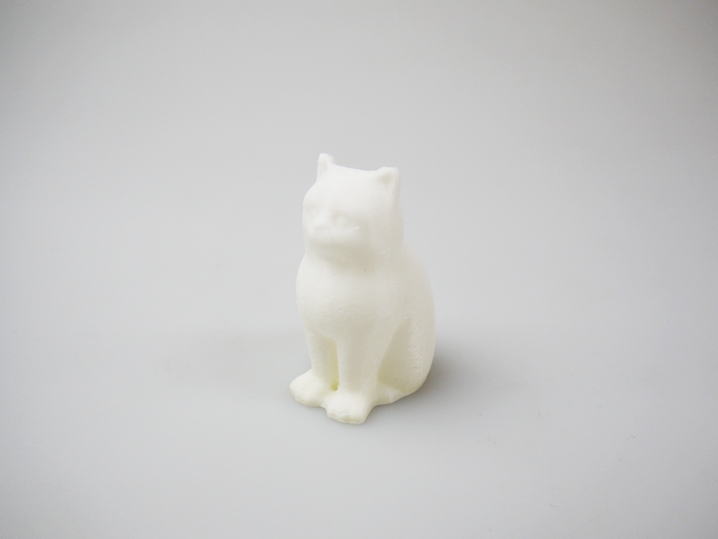
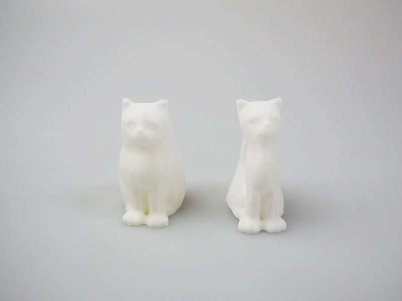

 

## #17 “感温性”フィラメント（ユニチカ株式会社）
  

使用機種：Makerbot Replicator2（ヒートベッドなし） 
材料：[3Dプリンター用"感温性"フィラメント](http://www.unitika.co.jp/news/fiber/post_42.html) 
プリント温度：220℃ 
Layer Height（積層ピッチ）：0.2mm 
Infill：5% 
Number of Shells：2 
 

造形後に人肌やお風呂の湯温など安全な温度で温めると柔らかくなり、形状を自由に変更可能なフィラメント。
家庭用ドライヤーを3秒ほど当てただけで柔らかくなり、元々の形状は保たれたまま変形させることができる。

   

（Last Updated: 2018.06.19）

