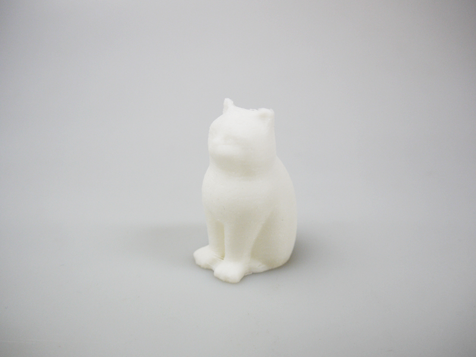
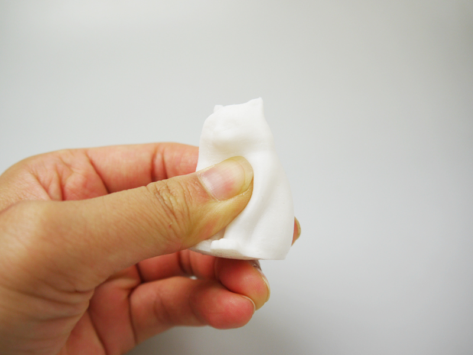

 

## #17 フレキシブル3Dプリンティング・フィラメント
  

使用機種：Makerbot Replicator2（ヒートベッドなし） 
材料：[polymaker PolyFlex TPU95（旧PolyFlex™）](https://www.poly-maker.jp/polyflex.html) 
プリント温度：230℃ 
Layer Height（積層ピッチ）：0.2mm 
Infill：5% 
Number of Shells：2 
 

フィラメントそのものが柔らかいため、出力された造形物も柔軟に曲げることができる。

   

（Last Updated: 2018.06.19）

