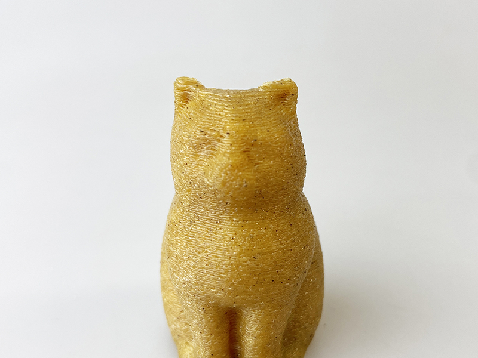

 

## (19) ビール原料フィラメント
  

使用機種：Makerbot Replicator2（ヒートベッドなし） 
材料：[3D-FUEL Buzzed Beer PLA](https://www.youtube.com/watch?v=4Zm-_Ux7nX4) 
プリント温度：210℃ 
Layer Height（積層ピッチ）：0.3mm 
Infill：10% 
Number of Shells：2 
 

ビールのような黄金色に着色されたフィラメント。黒い粒が混ざっており、一般的なPLAよりもザラついた質感。

   

（Last Updated: 2024.09.28）

