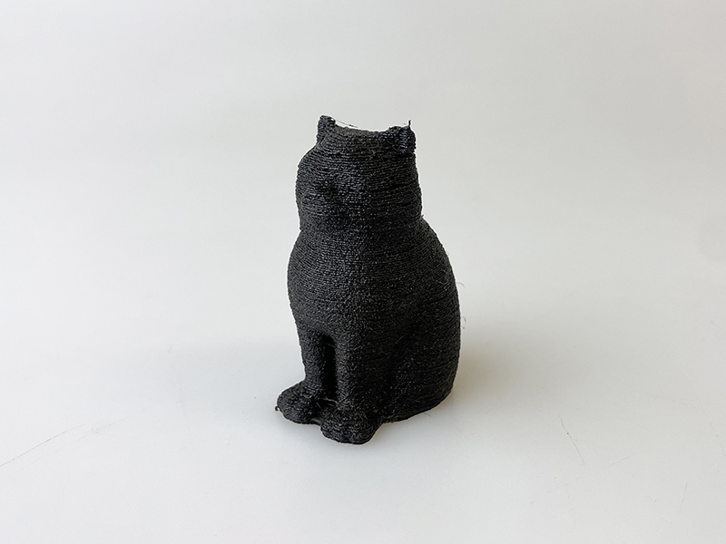
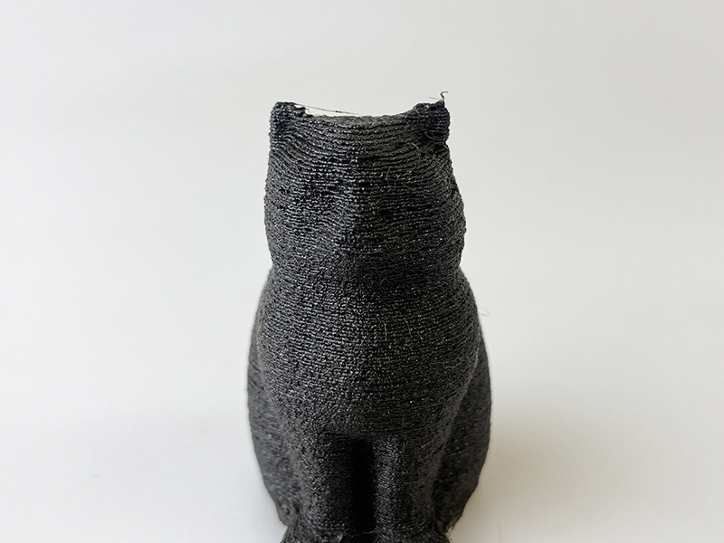

 

## (20) 黒檀フィラメント
  

使用機種：Makerbot Replicator2（ヒートベッドなし） 
材料：[FORM FUTURA EasyWood Ebony](https://formfutura.com/product/easywood/) 
プリント温度：210℃ 
Layer Height（積層ピッチ）：0.3mm 
Infill：10% 
Number of Shells：2 
 

黒檀の粉末が40%配合されている。フィラメント自体が非常にザラついた質感で、仕上がりも凹凸が目立つ。

   

（Last Updated: 2024.09.28）

