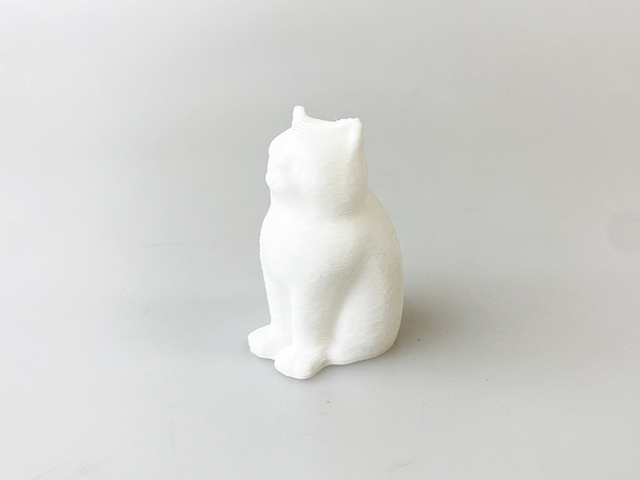

 

## (21) PLA白色フィラメント
  

使用機種：Makerbot Replicator2（ヒートベッドなし） 
材料：[Polymaker PolyLite PLA（旧PolyPlus PLA）](https://www.poly-maker.jp/polylite-pla.html) 
プリント温度：210℃ 
Layer Height（積層ピッチ）：0.3mm 
Infill：10% 
Number of Shells：2 
 

一般的なPLAフィラメントです。

   

（Last Updated: 2024.09.28）

