## 様々な材料での3Dプリント例
  

安価で手軽なFDM（熱溶解積層）方式の3Dプリンタでは、PLA（ポリ乳酸）をはじめ、様々な材料（フィラメント）を使用することができます。ここでは、FabLab SENDAI - FLATが実験を行った材料とその結果をご紹介します。 

 
 

<a href="https://fablabsendai.github.io/materials-archive/11-01.html" title="#01 PLA">
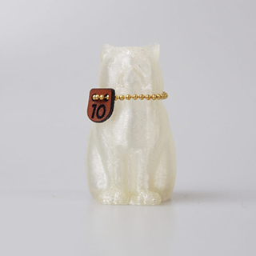
</a>
<a href="https://fablabsendai.github.io/materials-archive/11-02.html" title="#02 銅フィラメント">
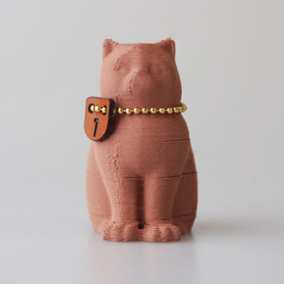
</a>

<a href="https://fablabsendai.github.io/materials-archive/11-06.html" title="#06 マグネティックフィラメント">
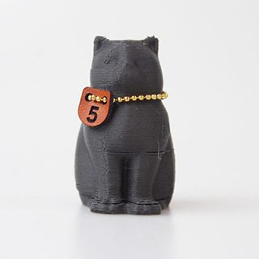
</a>
<a href="https://fablabsendai.github.io/materials-archive/11-07.html" title="#07 竹フィラメント">
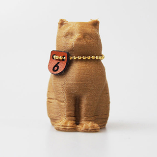
</a>

<a href="https://fablabsendai.github.io/materials-archive/11-09.html" title="#09 蓄光フィラメント">
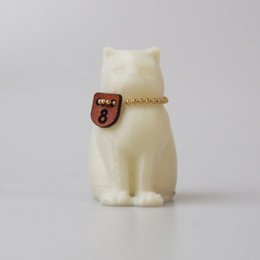
</a>
<a href="https://fablabsendai.github.io/materials-archive/11-10.html" title="#10 分解性フィラメント">
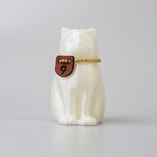
</a>
<a href="https://fablabsendai.github.io/materials-archive/11-11.html" title="#11 ルミシスフィラメント">
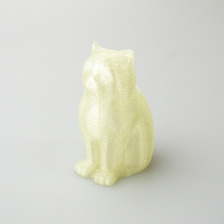
</a>
<a href="https://fablabsendai.github.io/materials-archive/11-12.html" title="#12 高性能コポリエステルフィラメント">
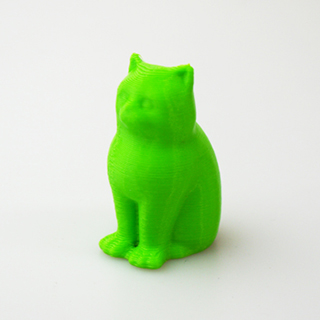
</a>
<a href="https://fablabsendai.github.io/materials-archive/11-13.html" title="#13 コルク原料フィラメント">
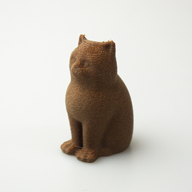
</a>
<a href="https://fablabsendai.github.io/materials-archive/11-14.html" title="#14 形状記憶ポリマーフィラメント">
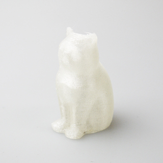
</a>
<a href="https://fablabsendai.github.io/materials-archive/11-15.html" title="#15 軽量、高品質PLAフィラメント">
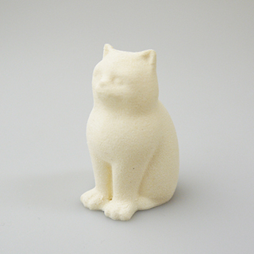
</a>
<a href="https://fablabsendai.github.io/materials-archive/11-16.html" title="#16 高品質PLAフィラメント">
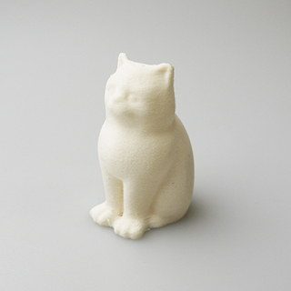
</a>
<a href="https://fablabsendai.github.io/materials-archive/11-17.html" title="#17 “感温性”フィラメント（ユニチカ株式会社）">
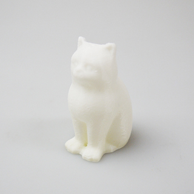
</a>
<a href="https://fablabsendai.github.io/materials-archive/11-18.html" title="#18 フレキシブル3Dプリンティング・フィラメント">
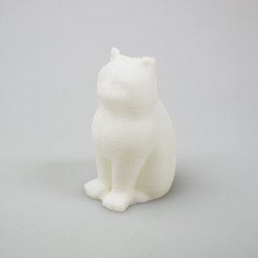
</a>

 

---

掲載している素材の加工結果はあくまで参考例です。製造メーカーや保管方法、加工状況等により結果が異なる場合がありますのでご注意ください。 
 
尚、本ページに掲載された情報の利用によって生じた損害については、一切の保証・賠償は行いません。ご利用に当たっては、ご自身の責任で行っていただきますようお願いいたします。

  

（Last Updated: 2022.10.31）

